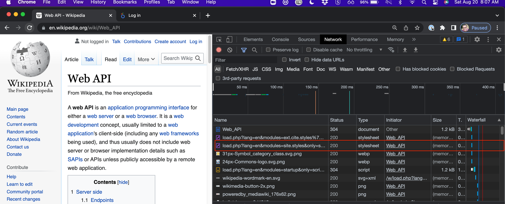
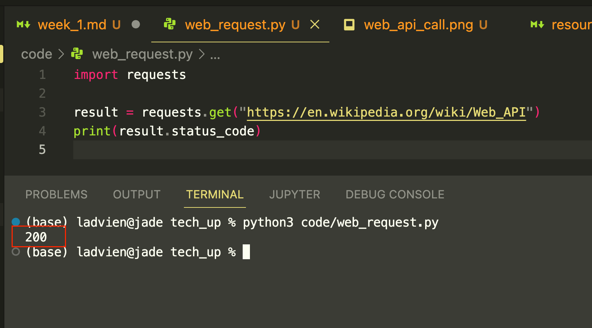
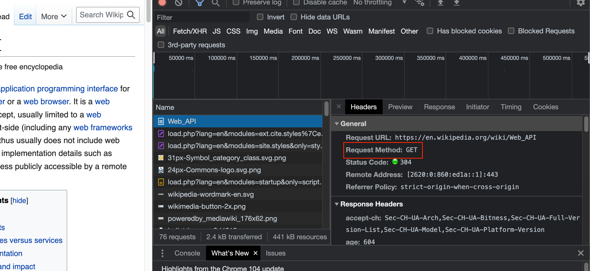

# Week 1

## Summary
The goals for this week: 
1. Getting comfortable with Python concepts
2. Retrieving data from lichess.com's web API

### Resources
* [Lichess API documentation](https://lichess.org/api#section/Introduction/Endpoint)

### Videos to watch:
* [pip -- Python Package Installer](https://www.youtube.com/watch?v=0PUxUMZJWu4)
* [JSON Crash Course](https://youtu.be/GpOO5iKzOmY)
* [21. Python dictionaries](https://www.udemy.com/course/the-complete-python-course/learn/lecture/9412524#overview)
* [235. Code for this section](https://www.udemy.com/course/the-complete-python-course/learn/lecture/15206672)
* [236. Signing up to OpenExchangeRates](https://www.udemy.com/course/the-complete-python-course/learn/lecture/15206674#overview)
* [237. Getting all exchange rates from the API](https://www.udemy.com/course/the-complete-python-course/learn/lecture/15206678#overview)

### Concepts Learned by End
* Web API
* HTML
* HTTP / HTTPS
* JSON
* Dictionary / Key & Value pair
* List / Array / Collection
* Python packages / Pip

## Crash Course in Pull Chess Data
One of the most common tasks done in programming is retrieving data from a [web API](https://en.wikipedia.org/wiki/Web_API). "API" stands for application programming interface. It is a way for two computer systems to interact without a user interface being involved. 

> It is important to note "API" also refers to many other things, so you have to derive from context whether it is an *web* API.

For data people, web APIs are often a source of data. We are usually asked to take these data from a different web APIs and programmatically move it somewhere else. When talking about web APIs there are there are several base concepts we need to understand.

## HTTP / HTTPS
HTTP and HTTPS stand for "hyper-text transfer protocol" and "hyper-text transfer protocol secure." They are primarily how systems throughout the internet talk to one another. When open a webpage it is using this transfer protocol to retrieve HTML (hyper text markup language) and JavaScript code to your local computer, where it is run within your browser.

In Chrome, open the https://en.wikipedia.org/wiki/Web_API from earlier. Now, right click anywhere and select "Inspect." Then click on the "Network" section of the development tools. Lastly, refresh the page.



Each one of the entries in the network section with the "Initiator" of "Web API" is your browser asking for data from the Wikipedia website via the web API.

One more note, all traffic should be going through HTTPS now. This ensures any data sent between your computer and where you are going on the internet is encrypted so no one between can understand it.

### HTTP Request Codes
In the world of tech there is a standard for everything. It allows programmers to build applications which work together with some level of confidence. HTTP and HTTPS are no exceptions.  

One of the neat things about these protocols is they have status codes which tell you the status of a request you made of another system.

Dropping fancy talk, let's say your Python code makes a request for the Web API article on Wikipedia. 

```python
import requests

result = requests.get("https://en.wikipedia.org/wiki/Web_API")
print(result.status_code)
```
This code will print out the status code for retrieving the webpage.



Here is a list of status codes:

* [HTTP Status Codes](https://developer.mozilla.org/en-US/docs/Web/HTTP/Status)

> Quiz #1: What does the status code "200" mean?

### Web API Verbs
Programmers love to have a pattern when writing code. This helps us ensure the code is understandable as it grows. That is, if you write 50 lines of code and leave for a day, come back, it is not too hard to get your head back into. But if you have 10,000 lines of code across 20 files, if you don't have a pattern across all of the code then you don't have a mental model to understand the code. Each line must be understood one-by-one. This makes it exceed a cognitive complexity threshold. You may also hear developers talk about a project's "complexity budget."

Web API requests follow a well defined pattern. It has two major parts. The action one wants to take, followed by the resource one wants to take the action on.

In English we would say, "Jimmy got the ball."  With web APIs we would say, "Jonathan got the Wikipedia page on 'Web API's."  These sentences express complete thoughts.

Now, let's compare it to a web API request.
```
GET https://en.wikipedia.org/wiki/Web_API
```
Or going back to the Python code:
```python
result = requests.get("https://en.wikipedia.org/wiki/Web_API")
```

The `"https://en.wikipedia.org/wiki/Web_API"` is the resource and `get` is what we want do with it. Of course, there are many other words besides `get`. But each of them will be an action word, or, verb.  As such, we refer to these commands as the "HTTP verbs."

Here is a fairly complete list. Please read through all of them.

* [HTTP Verbs](https://developer.mozilla.org/en-US/docs/Web/HTTP/Methods)

If you go back to inspecting the network traffic on Wikipedia, you can click on a request entry and see more details about the request, including the request method (aka, verb).



> Quiz #2: When making an update to a resource what verb(s) should be used?

### HTML and JSON
Now we know a bit about how we can make requests of a web API, but we haven't talked about the data which an API sends back. There are thousands of different data formats which can be used, but luckily, the internet has agreed on two which are ubiquitous, `HTML` and `JSON`.

#### HTML
You are probably aware of HTML, but as I mentioned, it is hyper-text markup language. It looks something like this:

```html
<!DOCTYPE html>
<html lang="en">

<head>
  <title>Come-at-me-bro! Inc.</title>
</head>

<body>
    <main>
        <h1>Come-at-me-bro! Come-at-me-bro!</h1>
    </main>
    <footer class="footer">&copy; Come-at-me-bro! Inc.</footer>
</body>

</html>
```
The above HTML code is a complete website.

> Exercise: Copy the above code, save it on your Desktop as `index.html`, right click on the file and select "Open with Chrome / Firefox / Safari"

Notice how the web browser knows exactly what to do with the file? Web browsers have built in HTML interpreters. HTML and its partner CSS (cascading style sheets) are a huge topic by themselves. If you enjoy them, then you would probably enjoy a career in web site design (front-end engineer).

### JSON
"JSON" (pronounced "Jason") is not actually a coding language. It is a data format. Rather reexplaining what others have done a better job at, watch this video:

* [JSON Crash Course](https://youtu.be/GpOO5iKzOmY)

Let's look at some JSON.

```json
[
    {
        "name": "cross_online", 
        "id": "cross_online"
    }
]
```

Above is the data sent back when requesting results from the Lichess.com web API resource:

* [GET: Get realtime user status](https://lichess.org/api#tag/Users/operation/apiUsersStatus)

> Important: Python programmers often convert JSON objects into Python dictionaries, however, this is not always the case. And programmers often use the terms "dictionary" and "JSON" interchangeably, even though they are technically different.

These data can then be transformed and sent elsewhere, such as a database. Or used for visualization. Most JSON responses will contain an array (everything between `[]`) and inside the array dictionaries (stuff between `{}`).  Inside of these dictionaries, much like a real dictionary, there is a key and a value. These values can be retrieved from a dictionary with knowing the index and the key pair. For example, the `name` of the user retrieved can be found at the array's index `0` then the `key` `name`.  This will make more sense in the next section where we walk through the Python code to retrieve these data.

### Python Requests Library
Let's look at the Python code to retrieve the Lichess realtime status of a user.

```python
from rich import print
import requests

##############
# Parameters
##############
LICHESS_ID = "Cross_online"

##############
# Constants
##############
LICHESS_API_PATH = "https://lichess.org/api/"
ENDPOINT = "users/status"

RESOURCE_PATH = f"{LICHESS_API_PATH}{ENDPOINT}"
REQUEST_URL = f"{RESOURCE_PATH}?ids={LICHESS_ID}"

##############
# Request
##############
result = requests.get(REQUEST_URL)
data = result.json()

##############
# Get "name"
##############
```
First, we know all users are in an array. To get back the user we want, we need to know where in the array they are. For us, we know there's only one user called "Cross_Online" and since programmers start everything with `0` we know the user we seek at is the `0` index in the list

> A list of items has many names: "Collection," "Array," "List." Programmers have a bad habit of using these interchangeably. But in Python the idiomatic name is `list`.

Going back to our example, 
```json
[
    {
        "name": "cross_online", 
        "id": "cross_online"
    }
]
```
We can use square brackets attached to an item to retrieve the value of a list.

```python
...
first_user = data[0]
```
Now, the `first_user` variable will contain the following data.
```json
{
    "name": "cross_online", 
    "id": "cross_online"
}
```
Of course, this is only halfway there. We need the value from "name," but this time it is a dictionary, not a list. However, dictionaries also allow you to use square brackets to retrieve a value. But with dictionaries, they will want a written name. Let's look.

```python
...
users_name = first_user["name"]
```
This tells Python, "We want the value for the key `name` in the dictionary `first_user`. Once retrieved, assign the value to the variable `users_name`.

Ok, let's look at the full code.

```python
from rich import print
import requests

##############
# Parameters
##############
LICHESS_ID = "Cross_online"

##############
# Constants
##############
LICHESS_API_PATH = "https://lichess.org/api/"
ENDPOINT = "users/status"

RESOURCE_PATH = f"{LICHESS_API_PATH}{ENDPOINT}"
REQUEST_URL = f"{RESOURCE_PATH}?ids={LICHESS_ID}"

##############
# Request
##############
result = requests.get(REQUEST_URL)
data = result.json()

##############
# Get "name"
##############
first_user = data[0]
user_name = first_user["name"]
print(user_name)
```
> Note, before running this code you will need to install the `rich` package. To do that, follow the tutorial linked above on how to use the `pip` package manager. Or, simply go to the command line and type, `pip install rich`.

> Challenge: Take this code and run it yourself; refer to the documentation, adjust it to add a second Lichess user to the result set.

## Homework Assignment
Using the following resources, create a Python script which will do the following.

* [API Documentation](https://lichess.org/api#tag/Users/operation/apiUser)

1. Retrieve a user's public data.
2. Print the user's
   1. Their bio description.
   2. The date they created their account.
   3. Their total playtime.

> Hint, the full resource path is https://lichess.org/api/user/{username} and you will need to replace the username.

> Hint, when you retrieve a result from the `requests` library, you must attempt to convert it to a Python dictionary. This is done with the `json()` method. However, you will need to ensure the `status_code` is `200` before running `json()` as if there is no JSON data in the result you will get a weird error in Python.